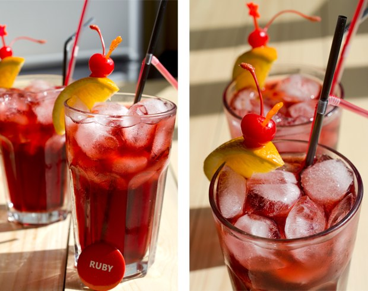
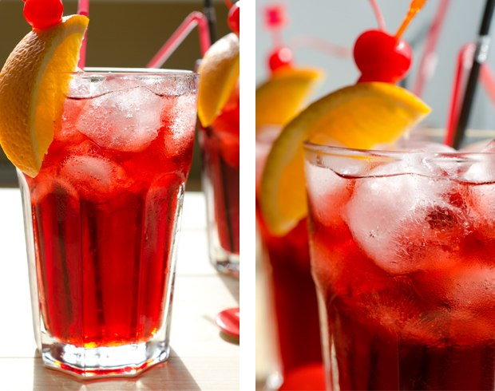
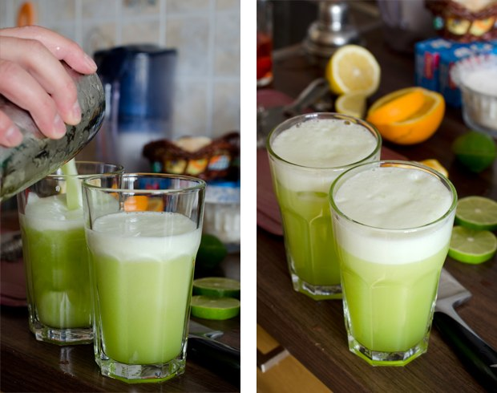
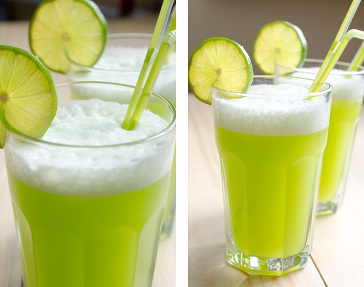
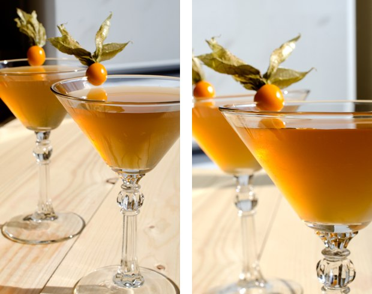
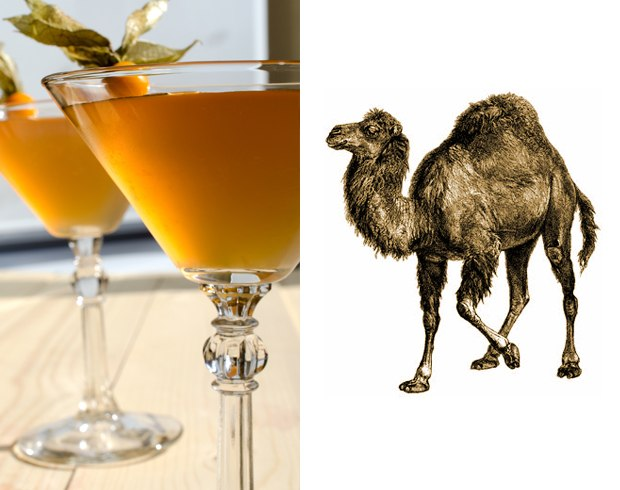
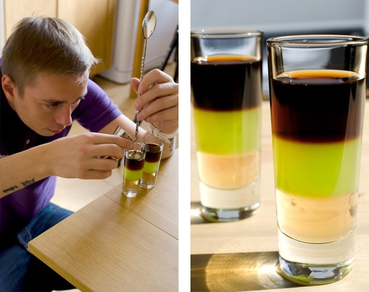
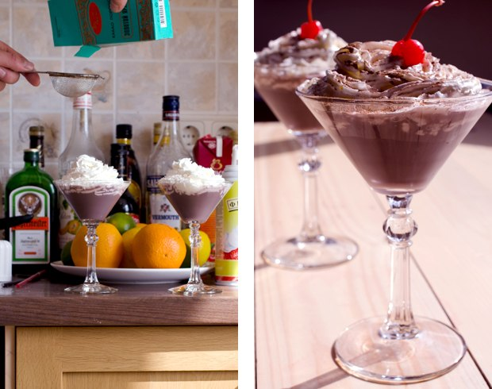
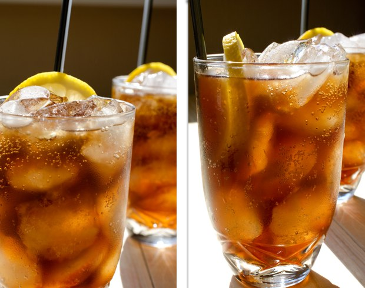
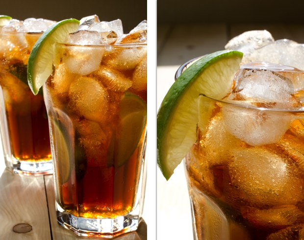

## Cocktails for programmers

* [Pусская версия](README.md)
* [English version](cocktails_for_programers.md)
* [Versão em Português](coqueteis_para_programadores.md)
* [Versiunea Română](cocktailuri_pentru_programatori.md)
* [Versión en Español](cócteles_para_programadores.md)
* [Version in Deutsch](cocktails_fuer_programmierer.md)
* [Version in Chinese](程序员鸡尾酒.md)
* [Turkish version](programcılar_için_kokteyller.md)
* [Versione Italiana](cocktails_per_programmatori.md)
* [한국어 버전](프로그래머를_위한_칵테일.md)
* [Version Française](cocktails_pour_programmeurs.md)

## Коктейли для программистов

Кулинарный проект, приуроченный к профессиональному празднику - "Дню программиста", который празднуется в 256 день в году. В сентябре 2013 этот день выпал на пятницу 13-е :)

Перед вами github-версия для форков и пулл-реквестов.

Оригинальный пост: http://habrahabr.ru/post/192942/

### Ruby






```
- 20 кокосовый ликер "Малибу"
- 20 ликер "Личи"
- 40 коньяк или бренди
- 150 вишневый сок
- лимон
- лёд
```

**Что делали:** добавили основные ингредиенты в высокий стакан, наполненный льдом. Добавили сок лимона (по вкусу). Тщательно перемешали до "запотевания" стакана. Украсили ломтиком апельсина и коктейльной вишней. Напиток получился достаточно сладкий, ароматный, освежающий. Рубиново-красный цвет коктейля отлично подходит под логотип языка ruby.

### Python





```
- 50 ром светлый
- 30 мятный ликер
- 30 ананас сок
- сок 1/2 лимона
- спрайт
```

**Что делали:** мы взбили  в шейкере со льдом основные ингредиенты. Всё перелили в бокал и долили 7up (или Спрайт), украсили бокал долькой лайма. Коктейль следует быстро подавать гостям - красивая пена быстро оседает. Напиток получился освежающим, с приятным ананасовым привкусом.

### Суровый Perl





```
- 30 джин
- 20 сухой вермут rosso
- 20 лимонный сок
- 10 сахарный сироп
```

**Что делали:** немного взбили шейкере со льдом основные ингредиенты. Процедили в бокал. Украсили <a href="http://ru.wikipedia.org/wiki/%D0%A4%D0%B8%D0%B7%D0%B0%D0%BB%D0%B8%D1%81">физалисом</a>.

### JMP (aka Assembler)



```
- 20 J-agermeister (травяной ликёр)
- 20 M-idori (дынный ликёр) +Лайм
- 20 P-each (Персиковый сироп)
```

**Что делали:** с помощью барной ложки уложили в высокий шот слои сиропа, дынного ликёра с небольшим кол-вом лаймового сока и травяного ликёра.

### Profit!



```
- 20 сливочный ликёр
- 20 черносмородиновый ликёр
- 20 triple sec (крепкий, сладкий апельсиновый ликёр)
- взбитые сливки
- какао порошок
```

**Что делали:** смешали в шейкере основные ингредиенты, украсили взбитыми сливками, посыпали какао порошком (лучше использовать мелкое сито), украсили вишенкой. Коктейль получился в меру сладкий и очень интересный на вкус.

### Epic fail



```
- 50 водка
- 100 кола
- 1/2 лимона
- лёд
```

**Что делали:** в стакан со льдом добавили основные ингредиенты. Тщательно смешали до "запотевания" стакана. Украсили лимоном.

По задумке лёд, лимон и кола полностью скрадывают привкус крепкого алкоголя. Если переусердствовать с употреблением, то может случиться реальный Былинный провал. Будьте крайне осторожны, если решитесь попробовать что-то подобное.

### Memory leak



```
- 50 текила
- 50 ром светлый
- 50 triple sec (крепкий, сладкий апельсиновый ликер)
- 50 кофейный ликер "kahlua"
- лайм
- кола
```

**Что делали:** все ингредиенты налили в бокал, наполненный льдом с кусочками лайма, тщательно перемешали. Украсили долькой лайма. Получилось вкусно и сногсшибательно.

### Коктейли готовили

* Исполнение - Артём aka "Салатыч ★ Ахтынг" [BARaDOMa.net](http://vk.com/baradomanet)
* Фото - Анна Нечаева. [Открытая Кухня Анны Нечаевой](http://open-cook.ru)
* Идея - Илья Зыкин. [github.com/the-teacher](https://github.com/the-teacher)

##### Published by MIT :)
## Cocktails for Programmers

A culinary project for a professional holiday - "Programmers Day", celebrated on the 256th day of the year.

This year Programmers Day is Friday the 13th of September! :)

Here is the GitHub version for forks and pull-requests.

Original post: http://habrahabr.ru/post/192942/ (in russian)

PS: [Great comments on Reddit](http://www.reddit.com/r/programming/comments/1m6n2g/cocktails_for_programmers/)

#### Versions

* [Pусская версия](README.md)
* [English version](cocktails_for_programers.md)
* [Versão em Português](coqueteis_para_programadores.md)
* [Versiunea Română](cocktailuri_pentru_programatori.md)
* [Versión en Español](cócteles_para_programadores.md)
* [Version in Deutsch](cocktails_fuer_programmierer.md)
* [Version in Chinese](程序员鸡尾酒.md)
* [한국어 버전](프로그래머를_위한_칵테일.md)

### Ruby


```
- 20 mL Malibu (coconut liqueur)
- 20 mL Lychee Liqueur (a fruit)
- 40 mL Cognac or Brandy
- 150 mL Cherry juice
- Lemon
- Ice
```

**Directions:**

1.  Add basic ingredients into a high glass filled with ice.
2.  Add lemon juice to taste.
3.  Thoroughly mix until the glass is misted.
4.  Garnish with a slice of orange and a maraschino cherry.

The drink will be sweet, fragrant, and fresh. This ruby-coloured cocktail perfectly matches the Ruby logo.

### Python

This cocktail looks like a [green python](https://www.google.ru/search?q=green+python&ie=UTF-8&tbm=isch&source=og). :snake:


```
- 50 mL White Rum
- 30 mL Mint Liqueur
- 30 mL Pineapple Juice
- Juice of Half a Lemon
- Sprite or 7 Up
```

**Directions:**

1.  Shake together with ice and strain.
2.  Pour into a glass and add Sprite or 7 Up.
3.  Garnish with a slice of lime.

This cocktail must be served fast - its froth dissapears quickly. This drink has a fresh pineapple taste.

### Severe Perl

Associations: severe, dry, desert, camel.


```
- 30 mL Gin
- 20 mL Sweet Vermouth (aka Rosso)
- 20 mL Lemon Juice
- 10 mL Syrup
```

**Directions:**

1.  Shake together with ice and strain.
2.  Garnish with [physalis](http://en.wikipedia.org/wiki/Physalis).

## JMP (aka Assembler)


```
- 20 mL Jagermeister (herbal liqueur)
- 20 mL Midori (melon liqueur) + Lime
- 20 mL Peach Syrup
```

**Directions:**

1.  Pour all the ingredients with a bar spoon in a high shot glass layer-by-layer.

### Profit!

Profit! should be sweet and airy. That's how we saw this cocktail.


```
- 20 mL Creamy Liqueur
- 20 mL Crème de Cassis
- 20 mL Triple Sec
- Whipped Cream
- Cocoa Powder
```

**Directions:**

1.  Shake together with ice and strain.
2.  Garnish with whipped cream and dust with cocoa powder (use a sifter for better results).
3.  Put a cherry on top.

This cocktail is pretty sweet with an interesting taste.

### Epic Fail


```
- 50 mL Vodka
- 100 mL Coke
- Juice of Half a Lemon
- Ice
```

**Directions:**

1.  Fill a glass of ice with all ingredients.
2.  Thoroughly mix till the glass is misted.
3.  Garnish with a lemon slice.

By design, the lemon and Coke conceal the taste of alcohol. But if you go too far, it will be a real epic fail. Be careful if you want to try something like this!

### Memory Leak


```
- 50 mL Tequila
- 50 mL White Rum
- 50 mL Triple Sec
- 50 mL Kahlua
- Lime
- Coke
```

**Directions:**

1.  Fill a glass with ice and small pieces of lime.
2.  Add the rest of the ingredients and mix.
3.  Garnish with a slice of lime and you've got tasty and stunning drink.

### Cocktails were made by

* Making - Artem aka "Salatych ★ Achtyng" [BARaDOMa.net](http://vk.com/baradomanet)
* Photo - Anna Nechaeva. [Anna's open cook](http://open-cook.ru)
* Idea - Ilya Zykin. [github.com/the-teacher](https://github.com/the-teacher)
* English v1.0 - [Sergey Romanov](https://github.com/srg-rmnv)
* English v2.0 - [Trevor Strieber](https://github.com/TrevorS)

##### Published by MIT :)


###Ship it! Should take lots of work and pack a punch, but in the end absolutely satisfying and relieving
## Cocktails für Programmierer

Ein kulinarisches Projekt für eine professionelle Auszeit - den "Programmierer-Tag", zelebriert am 256ten Tag des Jahres.

Der diesjährige Programmierer-Tag ist Freitag, der 13. September! :)

Dies ist die GitHub-Version für Forks und Pull-Requests.

Original Post: http://habrahabr.ru/post/192942/ (in russisch)

PS: [Großartige Kommentare auf Reddit](http://www.reddit.com/r/programming/comments/1m6n2g/cocktails_for_programmers/)

#### Versionen

* [Pусская версия](README.md)
* [English version](cocktails_for_programers.md)
* [Versão em Português](coqueteis_para_programadores.md)
* [Versiunea Română](cocktailuri_pentru_programatori.md)
* [Versión en Español](cócteles_para_programadores.md)
* [Version in Deutsch](cocktails_fuer_programmierer.md)
* [Version in Chinese](程序员鸡尾酒.md)
* [한국어 버전](프로그래머를_위한_칵테일.md)

### Ruby


```
- 20 mL Malibu (Kokosnusslikör)
- 20 mL Litschilikör
- 40 mL Cognac oder Brandy
- 150 mL Kirschsaft
- Zitrone
- Eis
```

**Anleitung:**

1.  Fülle die Grundzutaten in ein hohes, eisgefülltes Glas.
2.  Mit Zitronensaft abschmecken.
3.  Gewissenhaft mixen, bis das Glas beschlägt.
4.  Mit einer Orangenscheibe und Cocktailkirsche garnieren.

Das Getränk ist süß, duftend und erfrischend. Dieser rubinrote Cocktail passt perfekt zum Ruby-Logo.

### Python

Dieser Cocktail sieht aus wie eine [grüne Python](https://www.google.ru/search?q=green+python&ie=UTF-8&tbm=isch&source=og). :snake:


```
- 50 mL Weißer Rum
- 30 mL Minz Likör
- 30 mL Ananassaft
- Saft einer halben Zitrone
- Sprite oder 7 Up
```

**Anleitung:**

1.  Gewissenhaft mit Eis mixen.
2.  In ein Glas gießen und Sprite oder 7 Up zugeben.
3.  Mit einer Limettenscheibe garnieren.

Dieser Cocktail muss zügig serviert werden - sein Schaum löst sich schnell auf. Das Getränk hat einen erfrischenden Ananasgeschmack.

### Severe Perl

Erinnert an: rau, trocken, Wüste, Kamel.


```
- 30 mL Gin
- 20 mL Trockener Vermouth Rosso
- 20 mL Zitronensaft
- 10 mL Sirup
```

**Anleitung:**

1.  Gewissenhaft mit Eis mixen.
2.  Mit [Physalis](http://en.wikipedia.org/wiki/Physalis) garnieren.

## JMP (aka Assembler)


```
- 20 mL Jägermeister (Kräuterlikör)
- 20 mL Midori (Melonenlikör) + Limette
- 20 mL Pfirsichsirup
```

**Anleitung:**

1.  Gieße alle Zutaten mit Hilfe eines Barlöffels Schicht für Schicht in ein hohes Shot-Glas.

### Profit!

Profit! sollte süß und luftig sein. So haben wir diesen Cocktail kennengelernt.


```
- 20 mL Sahnelikör
- 20 mL Crème de Cassis
- 20 mL Triple Sec
- Schlagsahne
- Kakaopulver
```

**Anleitung:**

1.  Gewissenhaft mit Eis mixen.
2.  Mit Schlagsahne garnieren und Kakaopulver besträuen (nimm ein Sieb zur Hilfe).
3.  Setze eine Kirsche auf die Spitze.

Dieser Cocktail ziemlich süß, mit einem interessanten Geschmack.

### Epic Fail


```
- 50 mL Vodka
- 100 mL Cola
- Saft einer halben Zitrone
- Eis
```

**Anleitung:**

1.  Befülle ein eisgefülltes Glas mit allen Zutaten.
2.  Gewissenhaft mixen, bis das Glas beschlägt.
3.  Mit einer Zitronenscheibe garnieren.

Wie beabsichtigt, kaschieren Zitrone und Cola den Alkoholgeschmack. Wenn man es aber zu weit treibt, endet es in einem echten Epic Fail. Sei vorsichtig, wenn du so etwas ausprobieren willst!

### Memory Leak


```
- 50 mL Tequila
- 50 mL Weißer Rum
- 50 mL Triple Sec
- 50 mL Kahlua
- Limette
- Cola
```

**Anleitung:**

1.  Fülle ein Glas mit Eis und kleinen Limettenstücken.
2.  Füge den Rest der Zutaten zu und mixe.
3.  Mit einer Scheibe Limette garniert, ergibt es einen leckeren und atemberaubenden Drink.

### Cocktails wurden gemacht von

* Making - Artem aka "Salatych ★ Achtyng" [BARaDOMa.net](http://vk.com/baradomanet)
* Photo - Anna Nechaeva. [Anna's open cook](http://open-cook.ru)
* Idea - Ilya Zykin. [github.com/the-teacher](https://github.com/the-teacher)
* English v1.0 - [Sergey Romanov](https://github.com/srg-rmnv)
* English v2.0 - [Trevor Strieber](https://github.com/TrevorS)
* Deutsch - [David Enke](https://github.com/davidenke)

##### Veröffentlicht beim MIT :)


###Probiere es! Sollte eine Menge Arbeit machen und ordentlich reinhaun, aber am Ende ist es sehr zufriedenstellend und entspannend.
## Cocktails per Programmatori

Un progetto culinario per una festività professionale - "Il giorno del Programmatore", celebrato il 256° giorno dell'anno.

Post originale: http://habrahabr.ru/post/192942/ (in russian)

PS: [Commenti geniali su Reddit](http://www.reddit.com/r/programming/comments/1m6n2g/cocktails_for_programmers/)

#### Versioni

* [Russian version](README.md)
* [English version](cocktails_for_programers.md)
* [Versão em Português](coqueteis_para_programadores.md)
* [Versiunea in Romana](cocktailuri_pentru_programatori.md)
* [Versión en Español](cócteles_para_programadores.md)
* [Version in Deutsch](cocktails_fuer_programmierer.md)
* [Versione Italiana](cocktails_per_programmatori.md)
* [한국어 버전](프로그래머를_위한_칵테일.md)

### Ruby


```
- 20 mL Malibu (Rum al cocco)
- 20 mL Liquore di Litchis (un frutto tipico cinese)
- 40 mL Cognac o Brandy
- 150 mL Succo di Ciliegia
- Limone
- Ghiaccio
```

**Preparazione:**

1.  Aggiungere gli ingredienti dentro un bicchiere da aperitivo riempito di ghiaccio.
2.  Aggiungere succo di limone a piacere.
3.  Mescolare fino a che il vetro del bicchiere non si appanna.
4.  Guarnire con una fettina d'arancia e una ciliegia al maraschino.

La bevanda avrà un gusto dolce, fragrante e fresco. Questo cocktail color rubino si abbina perfettamente al logo di Ruby.

### Python

Questo cocktail deve ricordare il colore del [Pitone Verde](https://www.google.it/search?q=pitone+verde&ie=UTF-8&tbm=isch&source=og). :snake:


```
- 50 mL Rum Bianco
- 30 mL Liquore alla Menta
- 30 mL Succo d'Ananas
- Succo di mezzo Limone
- Sprite o 7 Up
```

**Preparazione:**

1.  Shakerare con ghiaccio.
2.  Versare in un bicchire e aggiungere la Sprite o la 7 Up.
3.  Guarnire con una fettina di limone.

Questo cocktail va servito rapidamente poiché la sua schiuma scompare rapidamente. Gusto di ananas fresco.

### Severe Perl

Associazione: forte, secco, deserto, cammello.


```
- 30 mL Gin
- 20 mL Vermouth Secco Rosso
- 20 mL Spremuta di limone
- 10 mL Sciroppo
```

**Preparazione:**

1.  Shakerare con ghiaccio e versare.
2.  Guarnire con della [physalis](http://it.wikipedia.org/wiki/Physalis).

## JMP (aka Assembler)


```
- 20 mL Jagermeister (liquore alle erbe)
- 20 mL Midori (liquore di melone) + Lime
- 20 mL Sciroppo alla pesca
```

**Preparazione:**

1.  Versare tutti gli ingredienti aiutandosi con un cucchiaio da bar in un bicchiere di vetro strato dopo strato.

### Profit!

Profitto! dovrebbe essere dolce e fresco. Ecco come abbiamo pensato questo cocktail.


```
- 20 mL Crema al Whiskey
- 20 mL Crème de Cassis (liquore rosso al ribes)
- 20 mL Triple Sec
- Panna montata
- Polvere di cocco
```

**Preparazione:**

1.  Shakerare con ghiaccio e versare.
2.  Guarnire con pana montata e spolverare con il cocco (utilizzare un setaccio per un risultato migliore).
3.  Una ciliegina decorativa non guasta.

Questo cocktail è molto dolce e ha un gusto molto interessante.

### Epic Fail


```
- 50 mL Vodka
- 100 mL Coca Cola
- Succo di mezzo limone
- Ghiaccio
```

**Preparazione:**

1.  Riempire un bicchiere con ghiaccio e gli ingredienti.
2.  Mescolare fino a che il vetro del bicchiere non si appanna.
3.  Guarnire con una fettina di limone.

Come da progetto, il limone e la Coca Cola nascondono il gusto dell'alcol. Ovviamente, un abuso di questo cocktail porta ad un vero e proprio fallimento epico. Fate attenzione se volete provare qualcosa di simile!

### Memory Leak


```
- 50 mL Tequila
- 50 mL Rum bianco
- 50 mL Triple Sec
- 50 mL Kahlua
- Lime
- Coca Cola
```

**Directions:**

1.  Riempite un bicchiere con ghiaccio e piccoli pezzettini di lime.
2.  Aggiungete il resto degli ingredienti e mescolate.
3.  Guarnite con una fettina di lime e avrete un cocktail sorprendente e gustoso.

### Cocktails è realizzato da

* Making - Artem aka "Salatych ★ Achtyng" [BARaDOMa.net](http://vk.com/baradomanet)
* Photo - Anna Nechaeva. [Anna's open cook](http://open-cook.ru)
* Idea - Ilya Zykin. [github.com/the-teacher](https://github.com/the-teacher)
* English v1.0 - [Sergey Romanov](https://github.com/srg-rmnv)
* English v2.0 - [Trevor Strieber](https://github.com/TrevorS)
* Italiano - [MiPnamic](https://github.com/MiPnamic)

##### Pubblicati da MIT :)
## Cocktails pour programmeurs

Un projet culinaire pour un jour ferié professionnel - Le "Programmers Day", fêté le 256ème jour de l'année.

Cette année, "Programmers Day" sera le 13 Septembre ! :)

Voici la version GitHub à forker et à mettre à jour.

Basé sur: http://habrahabr.ru/post/192942/ (en Russe)

PS: [Commentaires sur Reddit](http://www.reddit.com/r/programming/comments/1m6n2g/cocktails_for_programmers/)

#### Versions

* [Pусская версия](README.md)
* [English version](cocktails_for_programers.md)
* [Versão em Português](coqueteis_para_programadores.md)
* [Versiunea Română](cocktailuri_pentru_programatori.md)
* [Versión en Español](cócteles_para_programadores.md)
* [Version in Deutsch](cocktails_fuer_programmierer.md)
* [Version in Chinese](程序员鸡尾酒.md)
* [한국어 버전](프로그래머를_위한_칵테일.md)

### Ruby


```
- 20 mL Malibu (liqueur de noix de coco)
- 20 mL Liqueur de lychee
- 40 mL Cognac ou Brandy
- 150 mL Jus de cerise
- Citron
- Glace pilée
```

**Recette:**

1.  Ajouter les ingrédients de base dans un verre haut rempli de glace.
2.  Ajouter le jus de citron à votre guise.
3.  Mélanger avec soin jusqu'à ce que le verre soit embué.
4.  Agrémenter d'une tranche d'orange et d'une cerise au marasquin.

Le cocktail sera sucré, parfumé, et frais. Sa couleur correspond parfaitement à celle du logo Ruby.

### Python

Ce cocktail ressemble à un [python vert](https://www.google.ru/search?q=green+python&ie=UTF-8&tbm=isch&source=og). :snake:


```
- 50 mL Rhum blanc
- 30 mL Liqueur de menthe
- 30 mL Jus d'ananas
- Jus d'un demi citron
- Sprite ou 7 Up
```

**Recette:**

1.  Secouer tous les ingrédients ensembles avec la glace et filtrer.
2.  Verser dans un verre et ajouter le Sprite ou le 7 Up.
3.  Décorer d'une rondelle de citron.

Ce cocktail doit être servi rapidement - sa mousse tombe rapidement.

### Severe Perl

Associations: severe, sec, desert, chameau.


```
- 30 mL Gin
- 20 mL Sweet Vermouth (aka Rosso)
- 20 mL Jus de citron
- 10 mL Sirop
```

**Recette:**

1.  Secouer tous les ingrédients ensembles et filtrer.
2.  Décorer avec des [physalis](http://fr.wikipedia.org/wiki/Physalis).

## JMP (aka Assembler)


```
- 20 mL Jagermeister (liqueur d'herbes)
- 20 mL Midori (liqueur de melon) + Citron vert
- 20 mL Sirop de pèche
```

**Recette:**

1.  Verser tous les ingrédients avec une cuillère à mélange dans un verre haut, couche par couche (voir photo).

### Profit!

Profit! devrait être doux et léger. C'est comme ça qu'on le voit.


```
- 20 mL Creamy Liqueur
- 20 mL Crème de Cassis
- 20 mL Triple Sec
- Crème fouettée
- Cacao en poudre
```

**Recette:**

1.  Secouer tous les ingrédients ensembles et filtrer.
2.  Garnir de crème fouettée et saupoudrer de cacao (utiliser un tamis pour un meilleur résultat).
3.  Ajouter une cerise sur le tout.

Ce cocktail est assez sucré avec un goût interessant.

### Epic Fail


```
- 50 mL Vodka
- 100 mL Coca Cola
- Jus d'un demi citron
- Glace pilée
```

**Recette:**

1.  Remplir un verre avec la glace et tous les ingrédients.
2.  Mélanger jusqu'à ce que le verre soit embué.
3.  Décorer d'une rondelle de citron.

De par son concept, le jus de citron et le Coca dans ce cocktail masqueront le goût de l'alcool. Si vous allez trop loin, ça sera un vrai epic fail. Faites attention si vous voulez l'essayer !

### Memory Leak


```
- 50 mL Tequila
- 50 mL Rhum blanc
- 50 mL Triple Sec
- 50 mL Kahlua
- Citron vert
- Coca Cola
```

**Recette:**

1.  Remplir un verre avec de la glace et des zestes de citron vert.
2.  Ajouter le reste des ingrédients et mélanger.
3.  Décorez avec une rondelle de citron vert et vous obtiendrez un cocktail savoureux et surprenant.

### Les cocktails ont été composés par

* Making - Artem aka "Salatych ★ Achtyng" [BARaDOMa.net](http://vk.com/baradomanet)
* Photo - Anna Nechaeva. [Anna's open cook](http://open-cook.ru)
* Idea - Ilya Zykin. [github.com/the-teacher](https://github.com/the-teacher)
* English v1.0 - [Sergey Romanov](https://github.com/srg-rmnv)
* English v2.0 - [Trevor Strieber](https://github.com/TrevorS)
* Français v1.0 - [Furrtek](https://github.com/furrtek)

##### Published by MIT :)
## Cocktailuri pentru Programatori

Un proiect culinar pentru o zi de muncă liberă - "Ziua Programatorilor", sărbătorită în a 256-a zi din an.

În acest an, ziua programatorilor este sărbătorită Vineri 13 Septembrie! :)

Versiunea GitHub pentru forks și pull-requests.

Articol original: http://habrahabr.ru/post/192942/ (în Rusă)

P.S.: [Comentarii pe Reddit](http://www.reddit.com/r/programming/comments/1m6n2g/cocktails_for_programmers/)

#### Versiuni lingvistice

* [Pусская версия](README.md)
* [English version](cocktails_for_programers.md)
* [Versão em Português](coqueteis_para_programadores.md)
* [Versiunea Română](cocktailuri_pentru_programatori.md)
* [Versión en Español](cócteles_para_programadores.md)
* [Version in Deutsch](cocktails_fuer_programmierer.md)
* [Version in Chinese](程序员鸡尾酒.md)
* [한국어 버전](프로그래머를_위한_칵테일.md)

### Ruby


```
- 20 mL Malibu (lichior de cocos)
- 20 mL Lichior Lychee (fruct)
- 40 mL Coniac sau Brandy
- 150 mL Suc de cireșe
- Lămâie
- Gheață
```

**Mod de preparare:**

1.  Se adaugă ingredientele de bază într-un păhar mare plin cu gheață.
2.  Se adaugă lămâie după gust.
3.  Se mixează până când aburește păharul.
4.  Se decorează cu o felie de portocală și o cireașă.

Bautura va fi dulce, parfumata și proaspata. Culoarea cocktail-ului este asemanatoare cu a logo-ului Ruby.

### Python

Acest cocktail arată ca un [piton verde](https://www.google.ru/search?q=green+python&ie=UTF-8&tbm=isch&source=og). :snake:


```
- 50 mL Rom alb
- 30 mL Lichior de mentă
- 30 mL Suc de ananas
- Suc din jumătate de lamâie
- Sprite sau 7Up
```

**Mod de preparare:**

1.  Se amestecă toate ingredientele cu gheață.
2.  Se pun într-un pahar și se adaugă Sprite sau 7Up.
3.  Se ornează cu o felie de lamâie verde (lime).

Acest cocktail trebuie servit repede - spuma dispare în câteva clipe. Are un gust proaspăt de ananas.

### Severe Perl

Asocieri: Puternic, sec, desert, camila.


```
- 30 mL Gin
- 20 mL Vermut roșu sec
- 20 mL Suc de lămâie
- 10 mL Sirop
```

**Mod de preparare:**

1.  Se amestecă toate ingredientele cu gheață.
2.  Se ornează cu [physalis](http://en.wikipedia.org/wiki/Physalis).

## JMP (aka Assembler)


```
- 20 mL Jagermeister (lichior din plante)
- 20 mL Midori (lichior pepene galben) + Lămâie verde (lime)
- 20 mL Sirop de piersici
```

**Mod de preparare:**

1.  Se amestecă toate ingredientele cu o lingura de bar, într-un pahar înalt pentru shot, strat cu strat.

### Profit!

Cocktail-ul Profit trebuie sa fie dulce.


```
- 20 mL Lichior cremos
- 20 mL Lichior de coacază neagră
- 20 mL Triplu Sec
- Frișca
- Cacao
```

**Mod de preparare:**

1.  Se amestecă toate ingredientele cu gheață.
2.  Se ornează cu frișcă și se presoară praf de cacao (se poate folosii o sita).
3.  Se adaugă o cireașă în mijloc.

Acest cocktail este foarte dulce și cu un gust deosebit.

### Epic Fail


```
- 50 mL Vodka
- 100 mL Cola
- Suc din jumătate de lămâie
- Gheață
```

**Mod de preparare:**

1.  Se umple un pahar cu gheață și se adaugă toate ingredientele.
2.  Se mixează (amestecă) bine  până când aburește păharul.
3.  Se ornează cu o felie de lămâie.

Lamaia și cola ascund gustul de alcool, dar dacă întreci măsura, vei beneficia de un "EPIL FAIL" adevărat.

### Memory Leak


```
- 50 mL Tequila
- 50 mL Rom alb
- 50 mL Triplu Sec
- 50 mL Kahlua
- Lămâie verde
- Cola
```

**Mod de preparare:**

1.  Se umple un pahar cu gheață și cu mici felii de lămâie verde.
2.  Se adaugă restul ingredientelor și se amestecă.
3.  Se ornează cu o felie de lămâie și obțineți o bautură gustoasă.

### Cocktail-urile au fost făcute de:

* Creare - Artem aka "Salatych ★ Achtyng" [BARaDOMa.net](http://vk.com/baradomanet)
* Foto - Anna Nechaeva. [Anna's open cook](http://open-cook.ru)
* Idea - Ilya Zykin. [github.com/the-teacher](https://github.com/the-teacher)
* English v1.0 - [Sergey Romanov](https://github.com/srg-rmnv)
* English v2.0 - [Trevor Strieber](https://github.com/TrevorS)

##### Publicat de MIT :)
## Cócteles para programadores

Un proyecto culinario para un día festivo profesional, "Día del programador", celebrado el día 256 del año.

¡El Día del Programador de este año es el 13 de Septiembre! :)

Aquí está la versión de GitHub para forks and pull-requests.

Publicación Original: http://habrahabr.ru/post/192942/ (en ruso)

P.D: [Buenos comentarios en Reddit] (http://www.reddit.com/r/programming/comments/1m6n2g/cocktails_for_programmers/) (inglés)

#### Versiones

* [Pусская версия](README.md)
* [English version](cocktails_for_programers.md)
* [Versão em Português](coqueteis_para_programadores.md)
* [Versiunea Română](cocktailuri_pentru_programatori.md)
* [Versión en Español](cócteles_para_programadores.md)
* [Version in Deutsch](cocktails_fuer_programmierer.md)
* [Version in Chinese](程序员鸡尾酒.md)
* [한국어 버전](프로그래머를_위한_칵테일.md)

### Ruby


```
- 20 mL Malibú (licor de coco)
- 20 mL Licor de Lichi (una fruta asiatica)
- 40 mL Coñac o Brandy
- 150 mL Jugo de Cereza
- Limón
- Hielo
```

**Instrucciones:**

1.  Añade los ingredientes a un vaso con hielo.
2.  Agrega jugo de limón al gusto.
3.  Mezcla hasta que el vaso esté sudoroso.
4.  Adorna con una rebanada de naranja y una cereza.

La bebida es dulce al gusto y olfato, además de fresca. El color de este coctel combina con el logo de Ruby

### Python

Este cóctel luce como una [pitón verde](https://www.google.ru/search?q=green+python&ie=UTF-8&tbm=isch&source=og). :snake:


```
- 50 mL Ron blanco
- 30 mL Licor de menta
- 30 mL Jugo de piña
- Jugo de medio limón
- Sprite o 7 Up
```

**Instrucciones:**

1.  Mezcla todo junto con Hielo y agitalo.
2.  Sirve en un vaso y agrega la Sprite o 7 Up.
3.  Adorna con una rebanada de lima.

Este cóctel debe servirse rápido, su espuma desaparece rápido. Esta bebida tiene un sabor fresco a piña.

### Severe Perl

Asociaciones: intenso, seco, desierto, camello.


```
- 30 mL Gin
- 20 mL Vermú Rojo
- 20 mL Jugo de Limón
- 10 mL Jarabe
```

**Instrucciones:**

1.  Agita todos los ingredientes con hielo.
2.  Adorna con [physalis](http://en.wikipedia.org/wiki/Physalis).

## JMP (Ensamblador)


```
- 20 mL Jagermeister (licor de hierbas)
- 20 mL Midori (licor de melón) + Lima
- 20 mL Jarabe de Durazno
```

**Instrucciones:**

1.  Sirve todos los ingredientes con una cuchara en un vaso para 'shots' dobles, capa por capa.

### Profit!

La ganancia debería ser dulce y airosa. Así es como vimos este cóctel.


```
- 20 mL Licor cremoso
- 20 mL Crème de Cassis
- 20 mL Triple Sec (Curazao)
- Crema batida
- Escarcha de Cocoa
```

**Instrucciones:**

1.  Mezcla todo junto con hielo y agita.
2.  Adorna con cremad batida y espolvorea con cocoa (Utiliza un tamizado para mejores resultados).
3.  Coloca una cereza en la punta.

Este cóctel es dulce con un sabor interesante.

### Epic Fail


```
- 50 mL Vodka
- 100 mL Refresco de Cola
- Jugo de medio limón
- Hielo
```

**Instrucciones:**

1.  Llena un vaso de hielo con todos los ingredientes.
2.  Mezcla hasta que el vaso esté sudoroso.
3.  Adorna con una rebanada de lima.

Por diseño el limón y el refresco esconden el sabor del alcohol. Pero si te pasas de copas será un verdadero 'Epic fail'. ¡Cuidado si quieres intentar algo como esto!

### Memory Leak


```
- 50 mL Tequila
- 50 mL Ron blanco
- 50 mL Triple Seco
- 50 mL Kahlua
- Lima
- Refresco de Cola
```

**Instrucciones:**

1.  Llena un vaso con hielo y pedacitos de lima.
2.  Agrega el resto de los ingredientes y mezcla.
3.  Adorna con una rebanada de lima y tienes una bebida asombrosa.

### Los cócteles fueron hechos por:

* Creación - Artem aka "Salatych ★ Achtyng" [BARaDOMa.net](http://vk.com/baradomanet)
* Fotografía - Anna Nechaeva. [Anna's open cook](http://open-cook.ru)
* Idea - Ilya Zykin. [github.com/the-teacher](https://github.com/the-teacher)
* Inglés v1.0 - [Sergey Romanov](https://github.com/srg-rmnv)
* Inglés v2.0 - [Trevor Strieber](https://github.com/TrevorS)
* Español v1.0 - [Héctor Gómez](http://twitter.com/hectorgr)

##### Publicado por MIT :)
## Coquetéis para Programadores

Um projeto culinário para um feriado profissional - o "Dia do Programador", comemorado no 256º dia do ano.

Nesse ano, o Dia do Programador é na sexta-feira 13 de setembro! :)

Essa é a versão do GitHub para forks e pull-requests.

Post original: http://habrahabr.ru/post/192942/ (in russian)

PS: [Ótimos comentários no Reddit](http://www.reddit.com/r/programming/comments/1m6n2g/cocktails_for_programmers/)

#### Versions

* [Pусская версия](README.md)
* [English version](cocktails_for_programers.md)
* [Versão em Português](coqueteis_para_programadores.md)
* [Versiunea Română](cocktailuri_pentru_programatori.md)
* [Versión en Español](cócteles_para_programadores.md)
* [Version in Deutsch](cocktails_fuer_programmierer.md)
* [Version in Chinese](程序员鸡尾酒.md)
* [한국어 버전](프로그래머를_위한_칵테일.md)

### Ruby


```
- 20 mL Malibu (licor de coco)
- 20 mL Licor de Lichia (uma fruta)
- 40 mL Conhaque ou Brandy
- 150 mL Suco de cereja
- Limão
- Gelo
```

**Modo de preparo:**

1.  Ponha os ingredientes básicos em um copo alto cheio de gelo.
2.  Adicione suco de limão à gosto.
3.  Misture meticulosamente até tomar uma forma enevoada.
4.  Decore o copo com uma fatia de laranja e cereja.

O drink será doce, perfumado e refrescante. Esse coquetel com cor de rubi combina perfeitamente com a logo do Ruby.

### Python

Esse coquetel lembra uma [Píton verde](https://www.google.ru/search?q=green+python&ie=UTF-8&tbm=isch&source=og). :snake:


```
- 50 mL Rum branco
- 30 mL Licor de menta
- 30 mL Suco de abacaxi
- Suco de meio limão
- Sprite ou 7 Up
```

**Modo de preparo:**

1.  Bata os ingredientes com gelo e força.
2.  Coloque em um copo e adicione Sprite ou 7 Up.
3.  Decore com uma fatia de limão.

Esse coquetel deve ser servido rápido - a espuma desaparece rapidamente - e tem um gosto de abacaxi fresco.

### Severe Perl (Pérola Severa)

Associations: austeridade, seco, deserto, camelo.


```
- 30 mL Gin
- 20 mL Vermute vermelho seco
- 20 mL Suco de limão
- 10 mL Syrup/Xarope
```

**Directions:**

1.  Misture tudo com gelo e força.
2.  Enfeite com [physalis](http://en.wikipedia.org/wiki/Physalis).

## JMP (aka Assembler)


```
- 20 mL Jagermeister (licor de hervas)
- 20 mL Midori (licor de melão) + Lima-limão
- 20 mL Calda de pêssego
```

**Modo de preparo:**

1.  Despeje todos os ingredientes com uma Colher de Bar (Bailarina) em um copo alto de dose (shot), camada por camada.

### Profit!

Profit! tem um sabor doce e delicado. Foi assim que nós vimos esse coquetel:


```
- 20 mL Licor cremoso
- 20 mL Crème de Cassis
- 20 mL Triple Sec
- Chantilly
- Chocolate em pó
```

**Modo de preparo:**

1.  Misture os ingredientes com gelo e força.
2.  Decore com chantilly e polvilhe com chcolate em pó (use uma peneira para melhroes resultados).
3.  Coloque uma cereja no topo.

Esse coquetel é bem doce e tem um gosto interessante.

### Epic Fail


```
- 50 mL Vodca
- 100 mL Coca-Cola
- Suco de meio limão
- Gelo
```

**Modo de preparo:**

1.  Encha um copo de gelo com todos os ingredientes.
2.  Misture meticulosamente até tomar uma forma enevoada.
3.  Decore com uma fatia de limão.

Por natureza, o limão e a Coca-Cola escondem o gosto do álcool. Mas se você exagerar na dose, será uma verdadeira falha épica (epic fail). Tome cuidado se você quer tentar algo desse tipo!

### Memory Leak


```
- 50 mL Tequila
- 50 mL Rum branco
- 50 mL Triple Sec
- 50 mL Kahlua
- Lima-limão
- Coca-Cola
```

**Modo de preparo:**

1.  Encha um copo com gelo e pequenos pedaços de lima-limão.
2.  Adicione o resto dos ingredientes e misture.
3.  Decore com uma fatia de lima-limão e você terá uma bebida saborosa e impressionante.

### Os coquetéis foram feitos por

* Making - Artem aka "Salatych ★ Achtyng" [BARaDOMa.net](http://vk.com/baradomanet)
* Photo - Anna Nechaeva. [Anna's open cook](http://open-cook.ru)
* Idea - Ilya Zykin. [github.com/the-teacher](https://github.com/the-teacher)
* English v1.0 - [Sergey Romanov](https://github.com/srg-rmnv)
* English v2.0 - [Trevor Strieber](https://github.com/TrevorS)

##### Publicado pelo MIT :)
## Koktajle dla programistów

Kulinarny projekt na profesjonalne święto - "Dzień programistów", celebrowany 256 dnia roku.

W tym roku będziemy je obchodzić 13 sierpnia! :)

Tutaj jest wersja na GitHubie dla forków i pull-requestów.

Oryginalny post: http://habrahabr.ru/post/192942/ (po rosyjsku)

PS: [Świetne komentarze na Reddit](http://www.reddit.com/r/programming/comments/1m6n2g/cocktails_for_programmers/)

#### Wersje

* [Pусская версия](README.md)
* [English version](cocktails_for_programers.md)
* [Versao em Portugues](coqueteis_para_programadores.md)
* [Versiunea Română](cocktailuri_pentru_programatori.md)
* [Versión en Espanol](cócteles_para_programadores.md)
* [Version in Deutsch](cocktails_fuer_programmierer.md)
* [Version in Chinese](程序员鸡尾酒.md)
* [Wersja po polsku](koktajle_dla_programistow.md)
* [한국어 버전](프로그래머를_위한_칵테일.md)

### Ruby


```
- 20 ml Malibu (likieru kokosowego)
- 20 ml likieru z liczi
- 40 ml koniaku lub brandy
- 150 ml soku wiśniowego
- cytryna
- lód
```

**Wykonanie:**

1.  Wlać podstawowe składniki do wysokiej szklanki z lodem.
2.  Dodać sok z cytryny dla smaku.
3.  Dokładnie wymieszać.
4.  Udekorować, najlepiej plastrem pomarańczy i wiśnią.

Drink jest słodki, pachnący i odświeża. Koktajl w tym kolorze doskonale pasuje do logo Ruby.

### Python

Ten koktajl wygląda jak [zielony pyton](https://www.google.ru/search?q=green+python&ie=UTF-8&tbm=isch&source=og). :snake:


```
- 50 ml białego rumu
- 30 ml likieru miętowego
- 30 ml soku z ananasa
- sok z połówki cytryny
- Sprite lub 7 Up
```

**Wykonanie:**

1.  Wstrząsnąć razem z lodem i przecedzić.
2.  Wlać do szklanki i dodać jeden z napojów.
3.  Ozdobić plastrem limonki.

Koktajl musi być podany szybko, gdyż jego pianka bardzo szybko znika. Drink ten ma świeży, ananasowy smak.

### Ciężki Perl


```
- 30 ml ginu
- 20 ml słodkiego wermutu (aka Rosso)
- 20 ml soku z cytryny
- 10 ml syropu
```

**Wykonanie:**

1.  Wstrząsnąć razem z lodem i przecedzić.
2.  Udekorować [miechunką](http://pl.wikipedia.org/wiki/Miechunka).

## JMP (aka Assembler)


```
- 20 ml Jägermeistera (likieru ziołowego)
- 20 ml Midori (likieru melonowego) + cytryna
- 20 ml syropu brzoskwiniowego
```

**Wykonanie:**

1.  Wlać wszystkie składniki do wysokiego kieliszka, warstwa po warstwie.

### Zysk!

Zyski powinny być słodkie i przewiewne. Oto, jak widzieliśmy koktajl:


```
- 20 ml likieru kremowego
- 20 ml Creme de Cassis (likieru z czarnych porzeczek)
- 20 ml Triple Sec (słodkiego likieru pomarańczowego)
- bita śmietana
- kakao w proszku
```

**Wykonanie:**

1.  Wstrząsnić wszystkie składniki wraz z lodem i przecedzić.
2.  Udekorować bitą śmietaną i posypać kakao w proszku.
3.  Udekorować wisienką.

Koktajl jest słodki i ma ciekawy smak.

### Epic Fail


```
- 50 ml wódki
- 100 ml coli
- sok z połówki cytryny
- lód
```

**Wykonanie:**

1.  Napełnić szklankę lodem i wszystkimi składnikami.
2.  Dokładnie wymieszać, aż szkło stanie się zamglone.
3.  Udekorować plastrem cytryny.

Zgodnie z projektem, cytryna i cola ukryją smak alkoholu, więc po kilku takich drinkach możecie być pewni, że zaliczycie EPIC FAIL!

### Memory Leak


```
- 50 ml tequili
- 50 ml białego rumu
- 50 ml Triple Sec (słodkiego likieru pomarańczowego)
- 50 ml Kahlúa (słodkiego likieru kawowego)
- cytryna/limonka
- cola
```

**Wykonanie:**

1.  Wypełnić szklankę lodem i małymi kawałkami cytryny.
2.  Dodać resztę składników i wymieszać.
3.  Udekorować plastrem cytryny/limonki.

Wspaniały i smaczny drink!

### Koktajle zostały wykonane przez:

* Twórca - Artem aka "Salatych ? Achtyng" [BARaDOMa.net](http://vk.com/baradomanet)
* Zdjęcia - Anna Nechaeva. [Anna's open cook](http://open-cook.ru)
* Pomysł - Ilya Zykin. [github.com/the-teacher](https://github.com/the-teacher)
* English v1.0 - [Sergey Romanov](https://github.com/srg-rmnv)
* English v2.0 - [Trevor Strieber](https://github.com/TrevorS)

##### Opublikowano na licencji MIT :)


###Opublikuj to! Zajmuje to wiele pracy i nieźle kopie, ale w końcu jest absolutnie satysfakcjonujące i łagodzi :D
## Kokteiļi programmētājiem

Kulinārais projekts profesiju svētkiem - "Programmētāju dienai", kas tiek atzīmēta gada 256. dienā.

Šogad Programmētāju diena ir piektdienā, 13. septembrī! :)

Šī ir GitHub versija priekš forkiem un pull-rekvestiem.

Sākotnējais ieraksts: http://habrahabr.ru/post/192942/ (krieviski)

#### Versijas

* [Pусская версия](README.md)
* [English version](cocktails_for_programers.md)
* [Versão em Português](coqueteis_para_programadores.md)
* [Versiunea Română](cocktailuri_pentru_programatori.md)
* [Versión en Español](cócteles_para_programadores.md)
* [Version in Deutsch](cocktails_fuer_programmierer.md)
* [Version in Chinese](程序员鸡尾酒.md)
* [Latviskotā versija](kokteili_programmetajiem.md)
* [한국어 버전](프로그래머를_위한_칵테일.md)

### Ruby


```
- 20 mL Malibu (kokosriekstu liķieris)
- 20 mL Liči liķieris
- 40 mL Konjaks vai brendijs
- 150 mL Ķiršu sula
- Citrons
- Ledus
```

**Pagatavošana:**

1.  Salej pamatkomponentes atdzesētā collins glāzē, kas piepildīta ar ledu.
2.  Iespiež citrona sulu garšai.
3.  Pamatīgi samaisa līdz glāze ir "aizmiglojusies".
4.  Dekorē ar apelsīna šķēli un kokteiļa ķirsīti.

Dzēriens būs salds, aromātisks un atspirdzinošs. Kokteiļa rubīnkrāsa perfekti piestāv Ruby logotipam.

### Python


```
- 50 mL Gaišais rums
- 30 mL Piparmētru liķieris
- 30 mL Ananāsu sula
- Puscitrona sulas
- Sprite
```

**Pagatavošana:**

1.  Sašeiko visas pamatkomponentes ar ledu.
2.  Ielej glāzē un pielej Sprite.
3.  Dekorē ar laima šķēli.

Jāpasniedz ātri, jo skaistās putiņas ātri nosēžās. Šis dzēriens ir atsvaidzinošs ar patīkamu ananāsu garšu.

### Skarbais Perl


```
- 30 mL Džins
- 20 mL Sausais vermuts Rosso
- 20 mL Citrona sula
- 10 mL Cukura sīrups
```

**Pagatavošana:**

1.  Sašeiko visas pamatsastāvdaļas ar ledu.
2.  Dekorē ar [fizāli](http://en.wikipedia.org/wiki/Physalis).

## JMP (aka Assembler)


```
- 20 mL J-agermeister (zāļu liķieris)
- 20 mL M-idori (meloņu liķieris) + Laims
- 20 mL P-each (persiku sīrups)
```

**Pagatavošana:**

1.  Ielej augstajā šotu glāzē sīrupa slāni
2.  Ar bāra karotes palīdzību ielej slāni meloņu liķiera ar nelielu daudzumu laima sulas.
3.  Ar bāra karotes palīdzību ielej slāni Jagermeister

### Profit!


```
- 20 mL krējuma liķieris
- 20 mL upeņu liķieris
- 20 mL Triple Sec (stiprs, salds apelsīnu liķieris)
- Putukrējums
- Kakao pulveris
```

**Pagatavošana:**

1.  Sašeiko visas pamatsastāvdaļas.
2.  Izdekorē ar putukrējumu un pārkaisa ar kakao pulveri (labākam rezultātam izmantot sietiņu).
3.  Pa virsu uzliek ķirsi.

Kokteilis būs patīkami salds ar interesantu garšu.

### Epic Fail


```
- 50 mL Šņabis
- 100 mL Cola
- Puse citrona sulas
- Ledus
```

**Pagatavošana:**

1.  Iepilda glāzē ar ledu visas sastāvdaļas
2.  Pamatīgi samaisa līdz glāze būs "aizmiglojusies".
3.  Dekorē ar citrona šķēli.

Plānots, ka citrons un kola apslēps alkohola garšu. Bet, ja pārspīlēs ar dzeršanu, tad tas būs patiešām īsti episka izgāšanās. Esiet uzmanīgi, ja vēlaties izmēģināt, ko šādu!

### Memory Leak


```
- 50 mL Tekila
- 50 mL Gaišais rums
- 50 mL Triple Sec (stiprs, salds apelsīnu liķieris)
- 50 mL kafijas liķieris Kahlua
- Laims
- Cola
```

**Pagatavošana:**

1.  Piepilda glāzi ar ledu un maziem laima gabaliņiem.
2.  Pievieno atlikušās sastāvdaļas un kārtīgi samaisa.
3.  Izdekorē ar laima šķēli un ir izdevies apdullinošs dzēriens.

### Kokteiļus gatavoja

* Izpildījums - Артём aka "Салатыч ★ Ахтынг" [BARaDOMa.net](http://vk.com/baradomanet)
* Foto - Анна Нечаева. [Anna's open cook](http://open-cook.ru)
* Ideja - Илья Зыкин. [github.com/the-teacher](https://github.com/the-teacher)
* Tulkoja Didzis Uzuliņš, terminoloģijas kļūdas laboja [Diāna Oberšate](http://timsmints.lv/index.php/par-mums)

##### Published by MIT :)
## Koktejly pro programátory

Kulinářský projekt ke dni - "Programmers Day" (Den Programátorů, Programátorský Den), který se slaví 256. den v roce.

Tento rok vychází Programmers Day na Čtvrtek 12. Září! :)

Zde je GitHub verze pro fork a pull requesty.

Originální příspěvek: http://habrahabr.ru/post/192942/ (rusky)

PS: [Nejlepší komentáře na Reddit](http://www.reddit.com/r/programming/comments/1m6n2g/cocktails_for_programmers/)

#### Verze

* [Ruská verze](README.md)
* [Anglická verze](cocktails_for_programers.md)
* [Portugalská verze](coqueteis_para_programadores.md)
* [Rumunská verze](cocktailuri_pentru_programatori.md)
* [Španělská verze](cócteles_para_programadores.md)
* [Německá verze](cocktails_fuer_programmierer.md)
* [Čínská verze](程序员鸡尾酒.md)
* [Česká verze](koktejly_pro_programatory.md)
* [한국어 버전](프로그래머를_위한_칵테일.md)

### Ruby


```
- 20 mL Malibu (kokosový likér)
- 20 mL Liči likér (ovoce)
- 40 mL Koňak nebo Brandy
- 150 mL Třešňový džus
- Citrón
- Led
```

**Instrukce:**

1.  Přidejte základní suroviny do vysoké sklenice naplněné ledem.
2.  Přidejte citronový džus na ochucení.
3.  Míchejte, dokud nebude sklenice zamlžená.
4.  Ozdobíme plátkem pomeranče a koktejlovou třešní.

Nápoj bude sladký, voňavý a čestvý. Tento rubínově zbarvený koktejl dokonale ladí s logem Ruby.

### Python

Tento koktejl vypadá jako [krajta zelená (green python)](https://www.google.ru/search?q=green+python&ie=UTF-8&tbm=isch&source=og). :snake:


```
- 50 mL Bílého rumu
- 30 mL Mentolového likéru
- 30 mL Ananasového džusu
- Šťáva z půky citrónu
- Sprite nebo 7 Up
```

**Instrukce:**

1.  Zamíchejte společně s ledem a sceďte.
2.  Nalíte do sklenice a přidejte Sprite nebo 7 Up.
3.  Ozdobte plátkem limetky.

Tento koktejl musí být podáván rychle - jeho pěna rychle mizí. Tento drink má svěží ananasovou chuť.

### Severe Perl

Někdy také: severe (těžký, přísný, drsný), dry (suchý), desert (poušť), camel (velbloud).


```
- 30 mL Gin
- 20 mL Sladký Vermouth (aka Rosso)
- 20 mL Citrónový džus
- 10 mL Syrup
```

**Instrukce:**

1.  Zamíchejte společně s ledem a sceďte.
2.  Ozdobte s [physalis](http://en.wikipedia.org/wiki/Physalis).

## JMP (aka Assembler)


```
- 20 mL Jagermeister (bilinný likér)
- 20 mL Midori (melounový likér) + Limetka
- 20 mL Broskvový Syrup
```

**Instrukce:**

1.  Nalijte všechny složky pomocí barové lžičky do vysoké skleničky vrstvu po vrstvě.

### Profit!

Profit! by měl být sladký a vzdušný. To je, jak jsme viděli, tento koktejl.


```
- 20 mL Krémového likéru
- 20 mL Crème de Cassis
- 20 mL Triple Sec
- Šlehačka
- Kakaový prášek
```

**Instrukce:**

1.  Zamíchejte společně s ledem a sceďte.
2.  Ozdobíme šlehačkou a kakaovým práškem (použíjte sítko pro dosažení lepších výsledků).
3.  Přidáme třešinku na konec.

Tento koktejl je docela sladký se zajímavou chutí.

### Epic Fail


```
- 50 mL Vodka
- 100 mL Kola
- Šťáva z půlky citrónu
- Led
```

**Instrukce:**

1.  Naplňte sklenici ledem a ingrediencemi.
2.  Míchejte, dokud nebude sklenice zamlžená.
3.  Ozdobíme plátkem citrónu.

Standardně citron a cola skryjí chu’t alkoholu. Pokud to ale přeženete, bude to opravdu špatné selhání. Pokud chcete něco takovéhoto zkoušet, buďte opatrní!

### Memory Leak


```
- 50 mL Tequila
- 50 mL Bílý rum
- 50 mL Triple Sec
- 50 mL Kahlua
- Limetka
- Kola
```

**Instrukce:**

1.  Naplňte sklenici ledem a malými kousky limetky.
2.  Přidejte zbytek ingrediencí a zamíchejte.
3.  Ozdobte plátkem limetky a máte chutný a ohromující nápoj.

### Koktejly byly vyrobeny:

* Výroba - Artem aka "Salatych ★ Achtyng" [BARaDOMa.net](http://vk.com/baradomanet)
* Foto - Anna Nechaeva. [Anna's open cook](http://open-cook.ru)
* Nápad - Ilya Zykin. [github.com/the-teacher](https://github.com/the-teacher)
* Anglická verze v1.0 - [Sergey Romanov](https://github.com/srg-rmnv)
* Anglická verze v2.0 - [Trevor Strieber](https://github.com/TrevorS)

##### Publikováno pod licencí MIT :)


###Odešlete to! Mělo by to dát hodně práce a mělo by to mít pořádný říz, ale nakonec to bude naprosto uspokojující a uvolňující
## Programcılar için kokteyller

Bu proje her yılın 256. gününde kutlanan "Programcılar Günü" için düşünülmüş bir mutfak sanatları projesidir.

Bu yıl Programcılar Günü 13 Eylül Cuma gününe denk geliyor! :)

Bu depo da projeyi çatallamanız ve kendi dilinizi eklemeniz için GitHub sürümü.

Özgün ileti: http://habrahabr.ru/post/192942/ (rusça)

Not: [Reddit'teki yorumlar](http://www.reddit.com/r/programming/comments/1m6n2g/cocktails_for_programmers/)

#### Diğer diller

* [Rusça](README.md)
* [İngilizce](cocktails_for_programers.md)
* [Portekizce](coqueteis_para_programadores.md)
* [Romanca](cocktailuri_pentru_programatori.md)
* [İspanyolca](cócteles_para_programadores.md)
* [Almanca](cocktails_fuer_programmierer.md)
* [Çince](程序员鸡尾酒.md)
* [Türkçe](programcılar_için_kokteyller.md)
* [한국어 버전](프로그래머를_위한_칵테일.md)

### Ruby


```
- 20 mL Malibu (hindistan cevizi likörü)
- 20 mL Lychee Likörü (bir meyve)
- 40 mL Konyak veya Brandy
- 150 mL Vişne suyu
- Limon
- Buz
```

**Tarif:**

1.  Limon hariç bütün malzemeleri buzla dolu büyük bir bardağa koyun.
2.  Limonu sıkarak dilediğiniz kadarını bardağa ekleyin.
3.  İçeceğiniz kıvama gelinceye kadar karıştırın.
4.  Bir dilim portakal ya da maraschino vişnesiyle süsleyin.

İçeceğiniz tatlı ve taze bir aromaya sahip olacak. Kızıl rengiyle Ruby logosuna harika uyacak.

### Python

Bu kokteyl aynı [yeşil piton](https://www.google.ru/search?q=green+python&ie=UTF-8&tbm=isch&source=og) gibi gözüküyor. :snake:


```
- 50 mL Beyaz Rom
- 30 mL Nane Likörü
- 30 mL Ananas suyu
- Yarım limonun suyu
- Sprite veya 7 Up
```

**Tarif:**

1.  Malzemeleri buzla çalkalayın ve bir bardağa koyun.
2.  Bardağa Sprite ya da 7 Up ekleyin.
3.  Birkaç dilim yeşil limon ile bardağı süsleyin.

Bu kokteyl taze ananas suyu tadında ve hızlı servis etmelisiniz çünkü köpüğü çok çabuk sönüyor.

### Keskin Perl

Çağrışımlar: keskin, sek, çöl, deve.


```
- 30 mL Cin
- 20 mL Sek İtalyan Vermut
- 20 mL Limon suyu
- 10 mL Şurup
```

**Tarif:**

1.  Malzemeleri buzla iyice çalkalayın ve bardağa koyun.
2.  [Güveyfeneri](http://tr.wikipedia.org/wiki/Güveyfeneri) ile süsleyin.

## JMP (Assembler olarak da bilinir)


```
- 20 mL Jagermeister
- 20 mL Midori (kavun likörü) + Yeşil limon
- 20 mL Şeftali Şurubu
```

**Tarif:**

1.  Bütün malzemeleri uzun bir shot bardağına kaşıkla katman katman koyun.

### Kâr!

Kâr! tatlı ve havalı olmalı, bize göre kokteyl dediğin budur.


```
- 20 mL Kremalı Likör
- 20 mL Crème de Cassis (kuş üzümü likörü)
- 20 mL Triple Sec (portakal likörü)
- Kremşanti
- Kakao tozu
```

**Tarif:**

1.  Malzemeleri buzla karıştırın ve bardağa koyun.
2.  Üstüne kremşanti sıkın ve kremanın üzerine kakao tozunu serpin.
3.  Kremanın üstüne bir vişne koyarak süsleyin.

Bu kokteyl enterasan tatlı bir tada sahiptir.

### Epic Fail


```
- 50 mL Votka
- 100 mL Kola
- Yarım limon suyu
- Buz
```

**Tarif:**

1.  Bütün malzemeleri bir bardağa koyun.
2.  Malzemeler karışana kadar karıştırın.
3.  Bir dilim limonla bardağı süsleyin.

Tasarımı itibariyle limon ve kola alkolün tadını gizler. Fakat fazla içerseniz gerçek manada epic fail olacaktır. Bu tarz kokteylleri denerken dikkatli olun!

### Bellek sızıntısı


```
- 50 mL Tekila
- 50 mL Beyaz Rom
- 50 mL Triple Sec (portakal likörü)
- 50 mL Kahlua
- Yeşil limon
- Kola
```

**Tarif:**

1.  Bardağı buz ve küçük yeşil limon parçalarıyla doldurun.
2.  Kalan malzemeleri de bardağa ekleyin ve karıştırın.
3.  Bir dilim yeşil limon ile bardağı süsleyin.

### Buradaki kokteyllerin alındığı kaynaklar

* Making - Artem aka "Salatych ★ Achtyng" [BARaDOMa.net](http://vk.com/baradomanet)
* Photo - Anna Nechaeva. [Anna's open cook](http://open-cook.ru)
* Idea - Ilya Zykin. [github.com/the-teacher](https://github.com/the-teacher)
* English v1.0 - [Sergey Romanov](https://github.com/srg-rmnv)
* English v2.0 - [Trevor Strieber](https://github.com/TrevorS)

##### MIT lisansı altında yayınlanmıştır :)


### Ship it! Bolca efor sarfedecek fakat karşılığını alacaksınız, sonuçlar sizi tatmin edecek ve rahatlatacak.
## 程序员鸡尾酒

一个特意为专业节日“程序员日”而建立的鸡尾酒项目！“程序员日”在每年的第256天。

今年的程序员日在九月十三号周五！:)

特将本文放上Github让大家可以fork和pull request!

原帖地址: http://habrahabr.ru/post/192942/ (俄语)

PS: [来自Reddit的优评](http://www.reddit.com/r/programming/comments/1m6n2g/cocktails_for_programmers/)

#### 不同语言版本

* [俄语](README.md)
* [英语](cocktails_for_programers.md)
* [葡萄牙语](coqueteis_para_programadores.md)
* [罗马尼亚语](cocktailuri_pentru_programatori.md)
* [西班牙语](cócteles_para_programadores.md)
* [德语](cocktails_fuer_programmierer.md)
* [汉语](程序员鸡尾酒.md)
* [土耳其语](programcılar_için_kokteyller.md)
* [意大利语](cocktails_per_programmatori.md)
* [한국어 버전](프로그래머를_위한_칵테일.md)

### Ruby


```
- 20 毫升 Malibu (椰子利口酒)
- 20 毫升 荔枝酒
- 40 毫升 Cognac (一种白兰地酒) or Brandy (白兰地)
- 150 毫升 樱桃汁
- 柠檬
- 冰
```

**调制说明：**

1.  将基本原料加入装满冰的高杯里。
2.  加入柠檬汁。
3.  充分混合直至杯子冰透，杯子外壁都产生了水珠:)
4.  加上一片橙子和黑樱桃做点缀。

这是一款清爽香甜的鸡尾酒，它红宝石般的颜色完美对应Ruby的Logo。

### Python

这款鸡尾酒看起来像是一条 [green python](https://www.google.ru/search?q=green+python&ie=UTF-8&tbm=isch&source=og)。 :snake:


```
- 50 毫升 白朗姆酒
- 30 毫升 薄荷酒
- 30 毫升 菠萝汁
- 半个柠檬的柠檬汁
- 雪碧或者七喜
```

**调制说明:**

1.  上述原料和冰块一起在摇匀，之后滤掉冰块。
2.  倒入一个高杯并加入雪碧或者七喜。
3.  加上一片青柠作点缀。

这款鸡尾酒一定要快速饮用-它上面的泡沫消失的太快啦！它具有清新的菠萝口味。

### Severe Perl

联系: 粗糙, 干, 甜点, 骆驼。


```
- 30 毫升 琴酒
- 20 毫升 白标干苦艾酒
- 20 毫升 柠檬汁
- 10 毫升 糖浆
```

**调制说明:**

1.  加冰摇匀然后滤掉冰块。
2.  用 [灯笼果](http://zh.wikipedia.org/wiki/%E7%81%AF%E7%AC%BC%E6%9E%9C) 做装饰。

## JMP (aka Assembler)


```
- 20 毫升 Jagermeister (德国草药酒)
- 20 毫升 Midori (哈密瓜利口酒) + 青柠
- 20 毫升 水蜜桃糖浆
```

**调制说明:**

1.  用长柄吧台匙分层放入高烈酒杯。

### Profit!

Profit! 应该是甜蜜又轻快的感觉。至少我们的是这样觉得的 :)


```
- 20 毫升 奶油利口酒
- 20 毫升 黑醋栗甜酒
- 20 毫升 橙皮甜酒
- 生奶油
- 可可粉
```

**调制说明:**

1.  加冰摇匀然后滤掉冰块。
2.  用奶油和可可粉作点缀(最好用筛子均匀撒开可可粉)。
3.  再加上一颗樱桃。

这份鸡尾酒相当甜，味道也很有趣。

### Epic Fail


```
- 50 毫升 伏特加
- 100 毫升 可乐
- 半个柠檬的柠檬汁
- 冰
```

**调制说明:**

1.  杯子里盛满冰，倒入伏特加，可乐和柠檬汁。
2.  充分混合直至杯子冰透。
3.  加上一片柠檬做点缀。

柠檬和可乐在这份鸡尾酒里都是为了抵消一些酒精的味道。 不过要是放得太多了，那可真成了epic fail。小心尝试！

### Memory Leak


```
- 50 毫升 龙舌兰酒
- 50 毫升 白朗姆酒
- 50 毫升 橙皮甜酒
- 50 毫升 可可利口酒
- 青柠
- 可乐
```

**调制说明:**

1.  首先往被子里方面冰块和小片青柠。
2.  再放入其他原料充分混合。
3.  用一片青柠作装饰，一份好喝又漂亮的饮料就做好啦！

### 这些鸡尾酒由以下作者共同制作

* 调制 - Artem aka "Salatych ★ Achtyng" [BARaDOMa.net](http://vk.com/baradomanet)
* 摄影 - Anna Nechaeva. [Anna's open cook](http://open-cook.ru)
* 创意 - Ilya Zykin. [github.com/the-teacher](https://github.com/the-teacher)
* 英文 v1.0 - [Sergey Romanov](https://github.com/srg-rmnv)
* 英文 v2.0 - [Trevor Strieber](https://github.com/TrevorS)

##### 以 MIT许可 发布:)


###试试吧！这些酒有点儿难度，不过酒劲十足，相信你对结果会很满意的:)
## 프로그래머를 위한 칵테일

매년 256번째 날, 전문인들의 휴일인 "프로그래머의 날"을 위한 요리 프로젝트.

올해(2014년)의 프로그래머의 날은 9월 13일 토요일입니다! :)

이 저장소는 Fork와 Pull-request를 하기위한 GitHub버전입니다.

원문: http://habrahabr.ru/post/192942/ (러시아어)

PS: [Reddit의 굉장한 댓글들](http://www.reddit.com/r/programming/comments/1m6n2g/cocktails_for_programmers/)

### 버전

* [Pусская версия](README.md)
* [English version](cocktails_for_programers.md)
* [Versão em Português](coqueteis_para_programadores.md)
* [Versiunea Română](cocktailuri_pentru_programatori.md)
* [Versión en Español](cócteles_para_programadores.md)
* [Version in Deutsch](cocktails_fuer_programmierer.md)
* [Version in Chinese](程序员鸡尾酒.md)
* [한국어 버전](프로그래머를_위한_칵테일.md)

### Ruby


```
- 코코넛 리큐르 "말리부(Malibu)" 20 mL
- 리치 리큐르 20 mL
- 코냑 또는 브랜디 40 mL
- 체리 주스 150 mL
- 레몬
- 얼음
```

**제조법:**

1.  기본 재료를 얼음이 들어있는 하이볼 글라스에 넣는다.
2.  입맛에 따라 레몬즙을 넣는다.
3.  유리잔에 이슬이 맺힐 때까지 완전히 섞는다.
4.  오랜지 조각과 마라스카 체리로 장식을 한다.

이 음료는 달고, 향긋하며 신선한 맛이 납니다. 또한 루비 색상의 칵테일은 Ruby 로고와 완벽하게 일치합니다.

### Python

이 칵테일은 [녹색 비단뱀](https://www.google.ru/search?q=green+python&ie=UTF-8&tbm=isch&source=og)과 비슷한 색상을 냅니다. :snake:


```
- 화이트 럼 50 mL
- 민트 리큐르 30 mL
- 파인애플 주스 30 mL
- 레몬 반 개의 레몬즙
- 스프라이트 (또는 7-up)
```

**제조법:**

1.  Strain법으로 얼음과 모든 재료를 섞는다.
2.  유리잔에 붓고 스프라이트 또는 7-up을 넣는다.
3.  라임 조각으로 장식한다.

이 칵테일은 손님에게 빠르게 내어야합니다. 아름다운 거품이 빠르게 가라앉기 때문이죠. 이 음료는 청량감을 주는, 상쾌한 파인애플 맛이 납니다.

### 엄격한 Perl
(의미 확인 필요, 원문: Суровый Perl)


```
- 진 30 mL
- 드라이 베르무트(Dry Vermouth) "Rosso" 20 mL
- 레몬 주스 20 mL
- 시럽 10 mL
```

**제조법:**

1.  Strain법으로 얼음과 모든 재료를 섞는다.
2.  [피잘리스](http://en.wikipedia.org/wiki/Physalis)로 장식한다.

### JMP (aka Assembler)


```
- 허브 리큐르 "예거마이스터(Jägermeister)" 20 mL
- 멜론 리큐르 "미도리(Midori)" + 라임 즙 20 mL
- 복숭아 시럽 20 mL
```

**제조법:**

1.  바 스푼을 이용하여 시럽, 멜론 리큐르+라임 즙, 허브 리큐르를 순서대로 높은 샷잔에 한겹한겹 붓는다.

### Profit!


```
- 크림 리큐르 20 mL
- 블랙커런트 리큐르 "크렘 드 카시스(Crème de Cassis)" 20 mL
- 강렬하고 달콤한 오랜지 리큐르 "트리플 섹(Triple Sec)" 20 mL
- 휘핑 크림
- 코코아 가루
```

**제조법:**

1.  Strain법으로 얼음과 모든 재료를 섞는다.
2.  휘핑 크림을 올리고 코코아 가루를 뿌린다. (고운 체를 이용하는 것이 좋다).
3.  체리로 장식한다.

이 칵테일은 적당히 달고 흥미로운 맛이 납니다.

### Epic Fail


```
- 보드카 50 mL
- 콜라 100 mL
- 레몬 반개의 즙
- 얼음
```

**제조법:**

1.  얼음이 가득 채워져있는 잔에 모든 재료를 넣는다.
2.  유리잔에 이슬이 맺힐 때까지 완전히 섞는다.
3.  레몬 조각으로 장식한다.

의도된대로, 얼음과 레몬즙, 콜라가 완벽하게 알콜맛을 가리게 됩니다. 하지만 너무 많이 마시면, 정말로 부끄럽고 창피한 실수(Epic fail)가 생길 수도 있습니다. 이런 음료를 한 번 마셔보기를 원한다면, 극도로 조심하세요!

### Memory Leak


```
- 테킬라 50 mL
- 라이트 럼 50 mL
- 트리플 섹 50 mL
- 깔루아 50 mL
- 라임
- 콜라
```

**제조법:**

1.  얼음과 작은 라임 슬라이스가 가득찬 잔에 모든 재료를 붓고 완전히 섞는다.
2.  라임 조각으로 장식한다.

여러분은 맛있고 놀랄만한 음료를 맛보게 될 것입니다.

### 이 칵테일은 다음 분들이 만들었습니다.

* 제조 - Artem aka "Salatych ★ Ahtyng" [BARaDOMa.net](http://vk.com/baradomanet)
* 사진 - Anna Nechaeva. [Anna Nechaeva의 요리법 공개](http://open-cook.ru)
* 아이디어 - Ilya Zykin. [github.com/the-teacher](https://github.com/the-teacher)
* 영어 번역 (v1.0) - [Sergey Romanov](https://github.com/srg-rmnv)
* 영어 번역 (v2.0) - [Trevor Strieber](https://github.com/TrevorS)
* 한국어 번역 - [Mabin](https://github.com/mabin359)

##### Published by MIT :)
